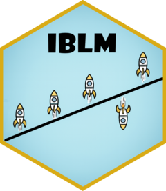

# IBLM 

## Interpretable Boosted Linear Models

[](https://CRAN.R-project.org/package=IBLM)
[](https://github.com/IFoA-ADSWP/IBLM/actions)
[](https://CRAN.R-project.org/package=IBLM)

---

### Overview

**IBLM** implements *Interpretable Boosted Linear Models* — a hybrid modelling approach that combines the transparency of generalized linear models (GLMs) with the predictive power of gradient boosting.  

The package provides:

- Functions for fitting interpretable boosted linear models  
- Tools to analyze and visualize model results  
- Support for model comparison and diagnostics  

---

### Installation

You can install the **released version** of IBLM from **CRAN**:

```r
install.packages("IBLM")
```

You can install the **development version** from GitHub:

```r
# install.packages("remotes")
remotes::install_github("IFoA-ADSWP/IBLM")
```

---

### Example

Here’s a minimal example to train and explain an IBLM:

```r
library(IBLM)

df_list <- freMTPLmini  |>
  split_into_train_validate_test()

iblm_model <- train_iblm_xgb(
  df_list,
  response_var = "ClaimRate",
  family = "poisson"
)

ex <- explain_iblm(iblm_model, df_list$test)


```


---

### Documentation

For Documentation on the various functions in this package visit:

🔗 [https://ifoa-adswp.github.io/IBLM/](https://ifoa-adswp.github.io/IBLM/)

---

### Contributing

Contributions are welcome!  
If you’d like to report a bug or suggest a feature, please open an issue on GitHub:

🔗 [https://github.com/IFoA-ADSWP/IBLM/issues](https://github.com/IFoA-ADSWP/IBLM/issues)

---

### Citation

If you use **IBLM** in research or teaching, please cite it as:

> Gawlowski, K. and Beard, P. (2025). *IBLM: Interpretable Boosted Linear Models.* R package version 1.0.2.

---

### License

This package is licensed under the **MIT License**.  
See the `LICENSE` file for full details.
